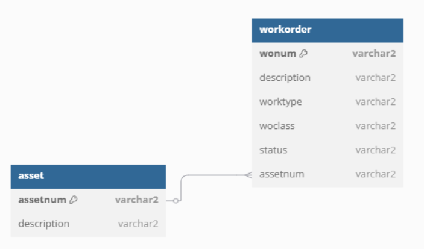
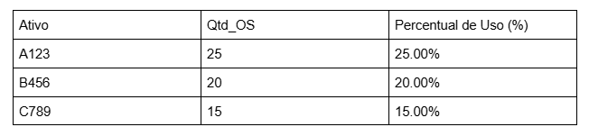

# Análise de ativos e ordens de serviço

## Objetivo do exercício
Este exercício tem como objetivo identificar os ativos que possuem maior número de ordens de serviço e calcular a participação percentual de cada um no total. Com isso, é possível compreender quais ativos demandam mais manutenção, ajudando na alocação de recursos e na manutenção preventiva.

## Conceitos Utilizados
- CTE (Common Table Expression): Utilizada para calcular o número total de ordens de serviço.
- Joins: INNER JOIN para conectar as tabelas asset e workorder.
- Funções de Agregação: COUNT() para contar ordens e ROUND() para formatar percentuais.
- Agrupamento e Ordenação: GROUP BY e ORDER BY para organizar os resultados.

## Modelo de dados


## Código SQL
```sql
WITH total_orders AS (
    SELECT COUNT(*) AS total_os FROM workorder
)
SELECT
    a.assetnum AS ativo,
    COUNT(*) AS qtd_os,
    ROUND((COUNT(*) * 100 / t.total_os), 2) AS percent_total
FROM
    asset a
INNER JOIN
    workorder w ON a.assetnum = w.assetnum
CROSS JOIN
    total_orders t
GROUP BY
    a.assetnum, t.total_os
ORDER BY
    qtd_os DESC;
```
## Explicação do Código
- WITH total_orders: Cria uma CTE que calcula o total de ordens.
- INNER JOIN entre asset e workorder: Relaciona os ativos às ordens de serviço.
- CROSS JOIN total_orders: Permite utilizar o total de ordens no cálculo do percentual.
- GROUP BY: Agrupa por ativo para contar quantas ordens cada um possui.
- ORDER BY qtd_os DESC: Organiza os resultados em ordem decrescente.

## Resultados obtidos


## Insights
- O ativo A123 é o mais demandado, correspondendo a 25% das ordens de serviço.
- Ativos com baixa quantidade de ordens podem indicar menor utilização ou alta confiabilidade.
- Esses dados ajudam a priorizar inspeções e recursos para manutenção preventiva.

## Conclusão
Este exercício demonstrou a aplicação de SQL para a análise de ativos, identificando quais equipamentos demandam mais manutenção. O uso de CTEs, funções de agregação e joins permite criar relatórios eficientes e acionáveis.
