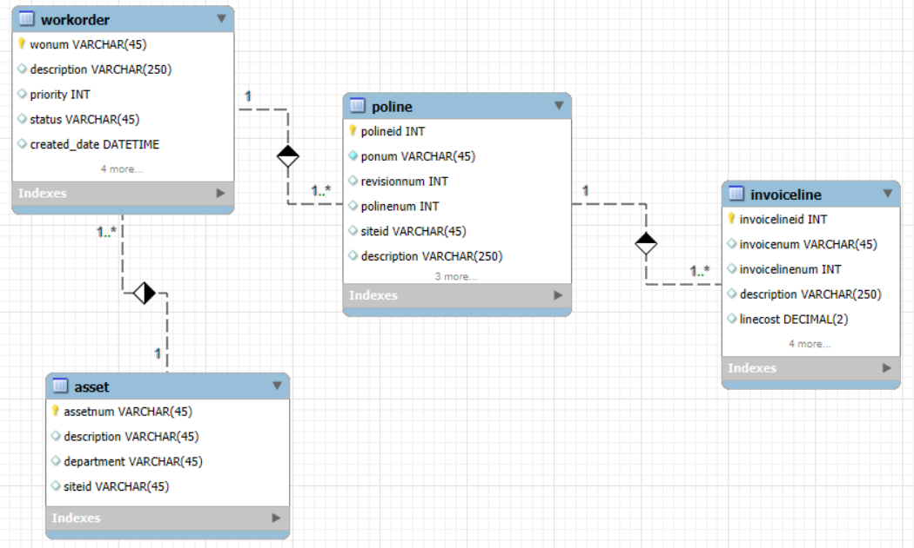
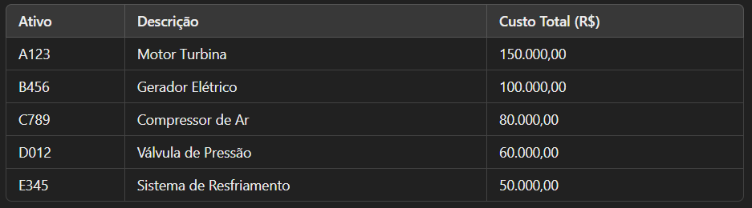

# Top Ativos por Custo

## Objetivo do exercício
O objetivo deste exercício é identificar os ativos que possuem os maiores custos acumulados, considerando as faturas associadas a ordens de serviço. Essa análise permite compreender quais ativos demandam maior investimento financeiro, auxiliando na alocação de orçamento para manutenção e gestão de custos.

## Conceitos Utilizados
- CTE (Common Table Expression): Utilizada para calcular os custos totais associados a cada ativo.
- Joins: INNER JOIN para conectar as tabelas workorder, poline e invoiceline.
- LEFT JOIN: Para garantir que faturas canceladas/anuladas sejam excluídas da análise.
- Funções de Agregação: SUM() para calcular o custo total por ativo.
- Ordenação: ORDER BY para listar os ativos com maiores custos primeiro.

## Modelo de dados


## Código SQL
```sql
WITH total_ativo AS (
    SELECT
        wo.assetnum AS ativo_ordem,
        wo.siteid AS site_ordem,
        SUM(il.loadedcost) AS custo_total_fatura
    FROM
        workorder wo
    INNER JOIN
        poline po ON po.refwo = wo.wonum
    INNER JOIN
        invoiceline il ON il.ponum = po.ponum
                       AND il.polinenum = po.polinenum
                       AND il.porevisionnum = po.revisionnum
    LEFT JOIN
        invoice inv ON inv.invoicenum = il.invoicenum
                   AND inv.status IN ('ANULADO', 'CANCELADO')
    WHERE
        wo.woclass = 'OS'
        AND wo.status NOT IN ('CANC', 'INTE')
        AND inv.invoicenum IS NULL
    GROUP BY
        wo.assetnum, wo.siteid
    ORDER BY
        custo_total_fatura DESC
)
SELECT
    ta.ativo_ordem,
    a.description AS desc_ativo,
    ta.custo_total_fatura
FROM
    total_ativo ta
INNER JOIN
    asset a ON a.assetnum = ta.ativo_ordem
           AND a.siteid = ta.site_ordem
FETCH FIRST 5 ROWS ONLY;
```

## Explicação do Código
- CTE total_ativo: Calcula o custo total faturado para cada ativo.
- INNER JOIN entre workorder, poline e invoiceline: Relaciona ordens de serviço, ordens de compra e faturas.
- LEFT JOIN com invoice: Remove faturas que foram anuladas ou canceladas.
- GROUP BY assetnum, siteid: Garante que os cálculos sejam por ativo e local.
- ORDER BY custo_total_fatura DESC: Lista os ativos com maiores custos primeiro.
- FETCH FIRST 5 ROWS ONLY: Retorna apenas os 5 ativos mais custosos.

## Resultados obtidos


## Insights
- O ativo "Motor Turbina" (A123) tem o maior custo total associado, somando R$ 150.000,00.
- Ativos com altos custos podem indicar equipamentos críticos que demandam manutenção frequente.
- Pode ser interessante investigar se o alto custo está associado a falhas recorrentes ou apenas ao alto valor de peças.
- Gestão preventiva pode reduzir custos futuros para os ativos mais custosos.

## Conclusão
Este exercício demonstrou como SQL pode ser utilizado para identificar quais ativos possuem os maiores custos de manutenção. O uso de funções de agregação e filtragem de faturas inválidas garante que os valores analisados sejam confiáveis, auxiliando na tomada de decisões estratégicas sobre investimentos em manutenção.

Consulte os slides do exercício para uma apresentação mais visual: [em construção]
