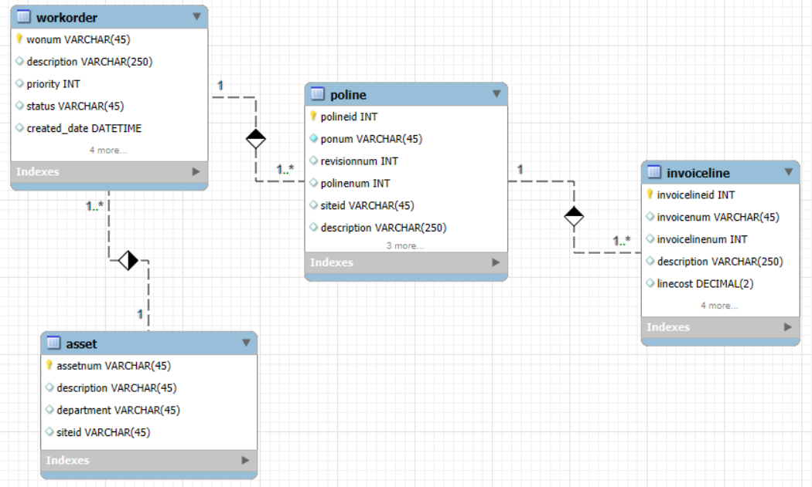

# Ranking de Ordens de Serviço por Tipo

## Objetivo do exercício
O objetivo deste exercício é classificar as ordens de serviço por custo total dentro de cada tipo de ordem (worktype), utilizando funções analíticas. Essa análise permite visualizar quais ordens geraram maior custo dentro de cada categoria, auxiliando na priorização de investimentos e na otimização de custos operacionais.

## Conceitos Utilizados
- CTE (Common Table Expression): Criada para calcular o custo total de faturas associadas a cada ordem de serviço.
- Função de Agregação SUM(): Usada para somar os custos faturados por ordem.
- Função Analítica RANK(): Responsável por classificar as ordens dentro de cada tipo.
- Joins: INNER JOIN para conectar workorder, poline, invoiceline e invoice.
- Filtragem de Registros: Exclusão de ordens canceladas e faturas anuladas.

## Modelo de dados


## Código SQL
```sql
WITH ordens_faturas AS (
    SELECT
        wo.worktype AS tipo_ordem,
        wo.wonum AS ordem,
        SUM(il.loadedcost) AS custo_linha_fatura
    FROM
        workorder wo
    INNER JOIN
        poline po ON po.refwo = wo.wonum
    INNER JOIN
        invoiceline il ON il.ponum = po.ponum
                       AND il.polinenum = po.polinenum
                       AND il.porevisionnum = po.revisionnum
    INNER JOIN
        invoice inv ON inv.invoicenum = il.invoicenum
                   AND inv.siteid = il.siteid
    WHERE
        wo.status = 'CONC'
        AND wo.woclass = 'OS'
        AND inv.status IN ('PAGO', 'ABERTO')
    GROUP BY
        wo.worktype, wo.wonum
)
SELECT
    of.tipo_ordem,
    of.ordem,
    of.custo_linha_fatura,
    RANK() OVER (PARTITION BY of.tipo_ordem ORDER BY of.custo_linha_fatura DESC) AS rank_por_custo
FROM
    ordens_faturas of
ORDER BY
    of.tipo_ordem, rank_por_custo;
```

## Explicação do Código
- CTE ordens_faturas: Calcula o custo total faturado para cada ordem de serviço.
- INNER JOIN entre workorder, poline e invoiceline: Relaciona ordens de serviço, ordens de compra e faturas.
- GROUP BY worktype, wonum: Garante que os cálculos sejam por tipo de ordem e ordem individual.
- RANK() OVER (PARTITION BY tipo_ordem ORDER BY custo_linha_fatura DESC): Cria um ranking das ordens dentro de cada tipo com base no custo total.
- ORDER BY tipo_ordem, rank_por_custo: Lista as ordens organizadas por tipo e ranking.

## Resultados obtidos
| Tipo de Ordem  | Ordem  | Custo Total (R$) | Ranking
|----------------|--------|------------------|-----
| PREVENTIVA     | WO001  | 50.000,00        |1
| PREVENTIVA     | WO002  | 30.000,00        |2
| CORRETIVA      | WO003  | 40.000,00        |1
| CORRETIVA      | WO004  | 35.000,00        |2

## Insights
- Dentro do tipo "Preventiva", a ordem WO001 tem o maior custo (R$ 50.000,00), indicando um serviço de alto impacto financeiro.
- No tipo "Corretiva", a ordem WO003 lidera com R$ 40.000,00, mas há uma diferença menor entre as ordens.
- Esse ranking pode ser usado para priorizar auditorias de custo e investigar possíveis otimizações.

## Conclusão
Este exercício demonstrou como SQL pode ser utilizado para classificar ordens de serviço por custo total dentro de cada categoria. A combinação de funções analíticas (RANK()) e agregações (SUM()) permitiu estruturar uma análise detalhada, possibilitando insights valiosos para a gestão de custos operacionais.

Consulte os slides do exercício para uma apresentação mais visual: [em construção]
